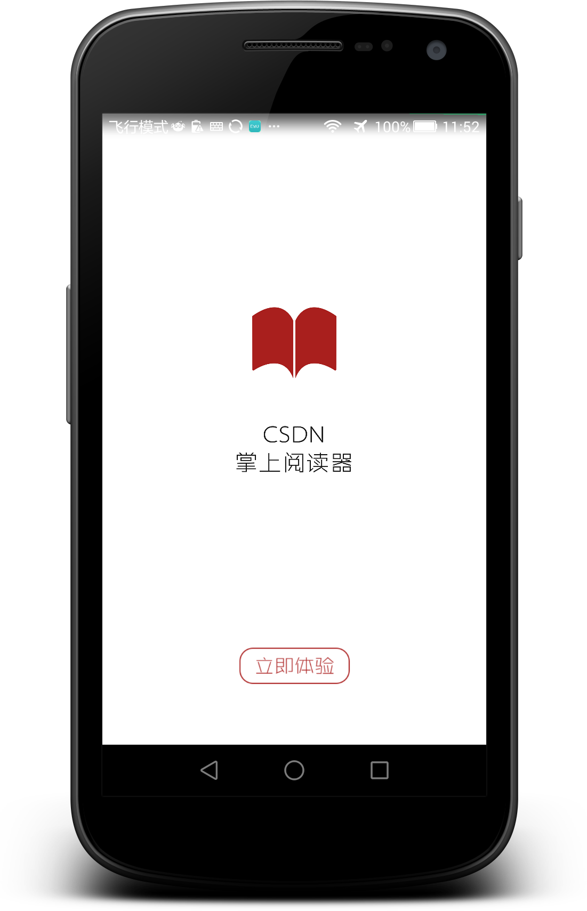

#News_csdn
  >Fetch the news from the www.csdn.net and group it by types.

##Introduction

#### Screenshots

* Welcomepage
 

* Homepage-1
 

* Homepage-2
 

* Detailpage
 

####Architecture

	User Interface
		|__ XListView
		|__ ViewPagerIndicator
		|__ Fragment
	
	News Resources
		|__ DataUtil
		|__ UrlUtil
		|__ DecodeUtil
		|__ AsyncTask

	Storage System
		|__ SQLite
		|__ SQLiteOpenHelper  
		|__ NewsItemDao
	
	Adapter
		|__ TabAdapter
		|__ NewsItemAdapter
		|__ NewsDetailAdapter

	Bean
		|__ NewsItem
		|__ NewsDetail
		|__ NewsDetailPart
		

####Functions

	<strong>XListView</strong>: provides the pull-to-refresh and pull-to-loadmore function.
	<strong>ViewPagerIndicator</strong>: an rubost plugin to provide smooth switch from fragment to fragment.

	<strong>UrlUtil</strong>: return the url according to the news type.
	<strong>DataUtil</strong>: use url to fetch html code and decode the news which consists of title, content, image link, link, date, news type.
	<strong>AsyncTask</strong>: create working threads to access csdn.net and fetch data.

	<strong>NewsItemDao</strong>: provide methods to add/delete/search/update items to dababase.

	<strong>TabAdapter</strong>: attach fragments to the ViewPagerIndicator.
	<strong>NewsItemAdapter</strong>: attach NewsItem to the XListView.
	<strong>NewsDetailAdapter</strong>: attach NewsDetailPart to the XListView in DetailActivity.

	<strong>NewsItem</strong>: store the title, content, image link, link, date, news type of news.
	<strong>NewsDetailPart</strong>: store the title, content, image link of every paragrah.

